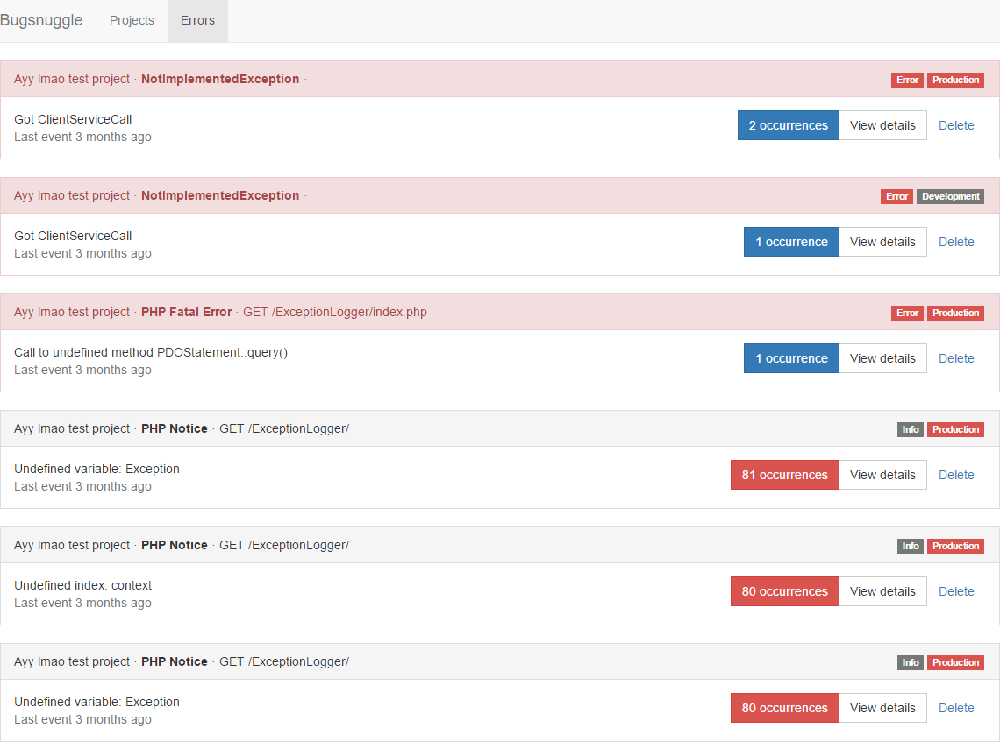
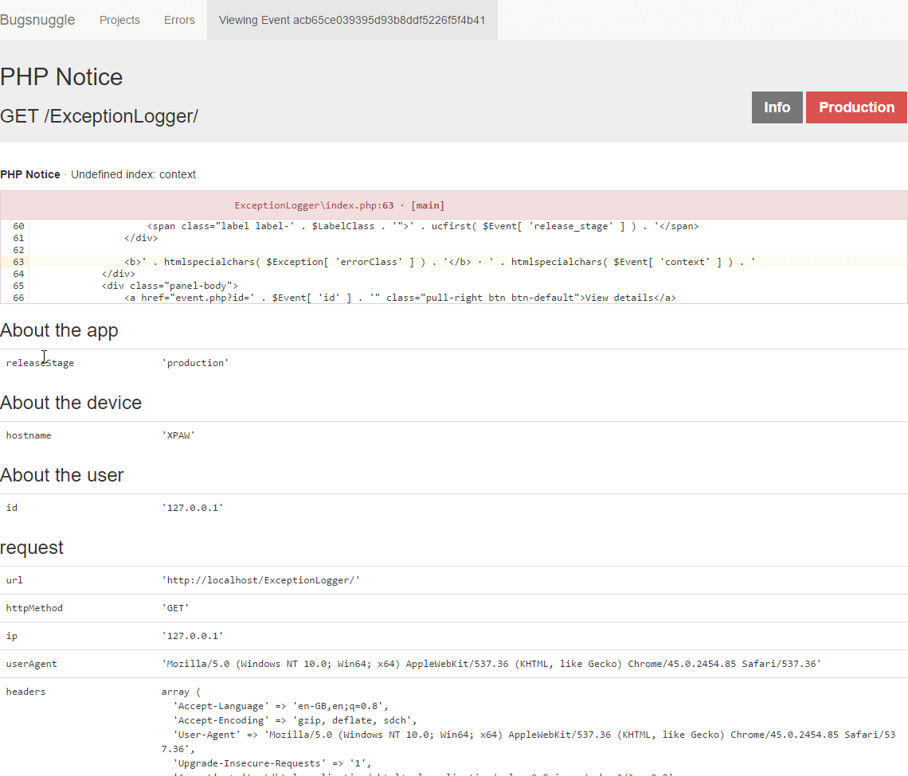

# Bugsnuggle

A crappy local clone of Bugsnag

How to use:

1. Setup [official Bugsnag notifier](https://bugsnag.com/docs/notifiers).
2. Change endpoint by using `setEndpoint` function in your notifier to point to `notify.php` of your local instance.
3. Watch the world :fire:

Viewing list of exceptions | Viewing a single exception
--- | ---
 | 
